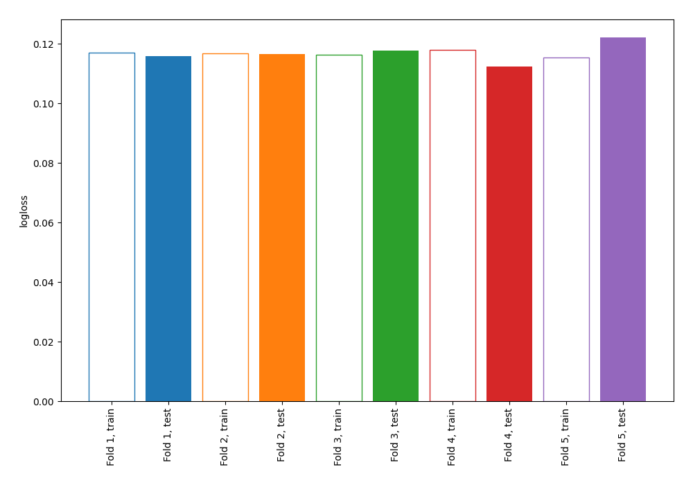
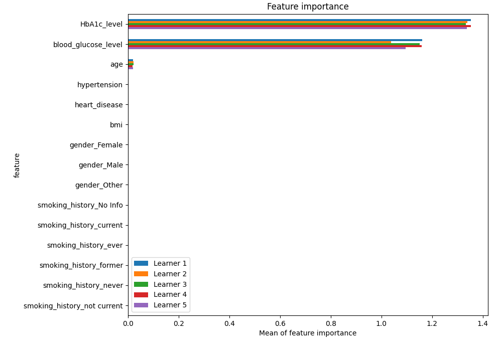
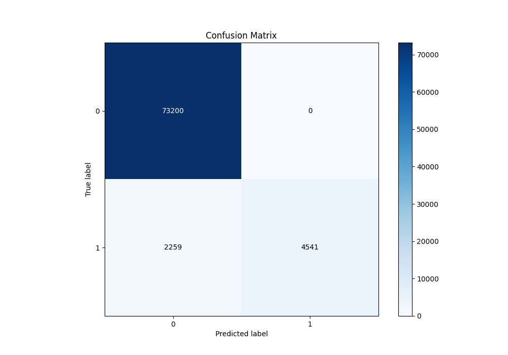
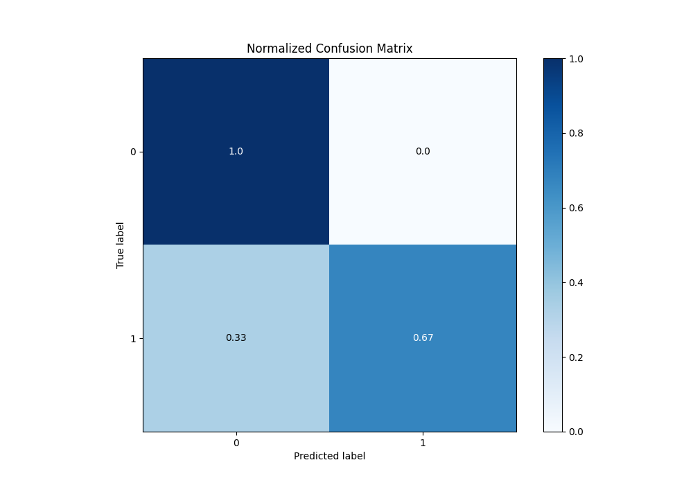
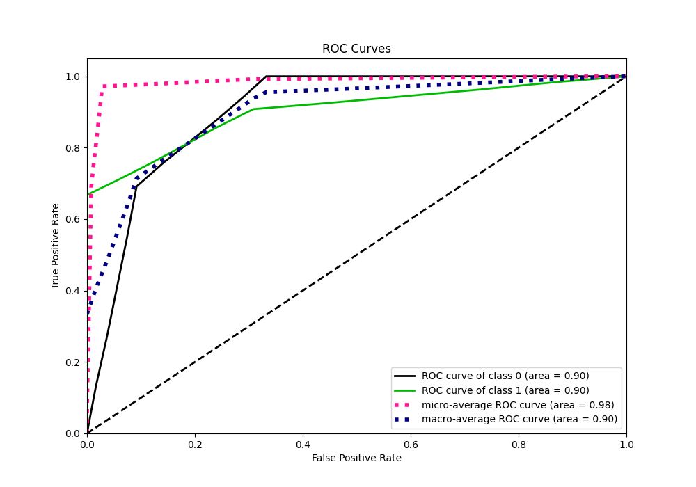
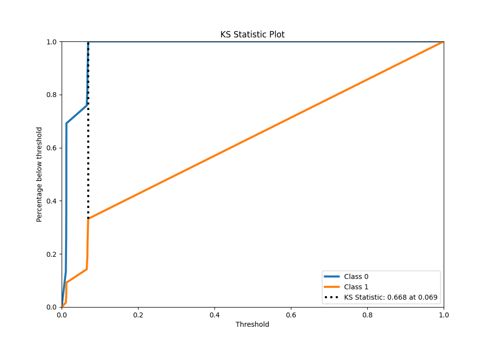
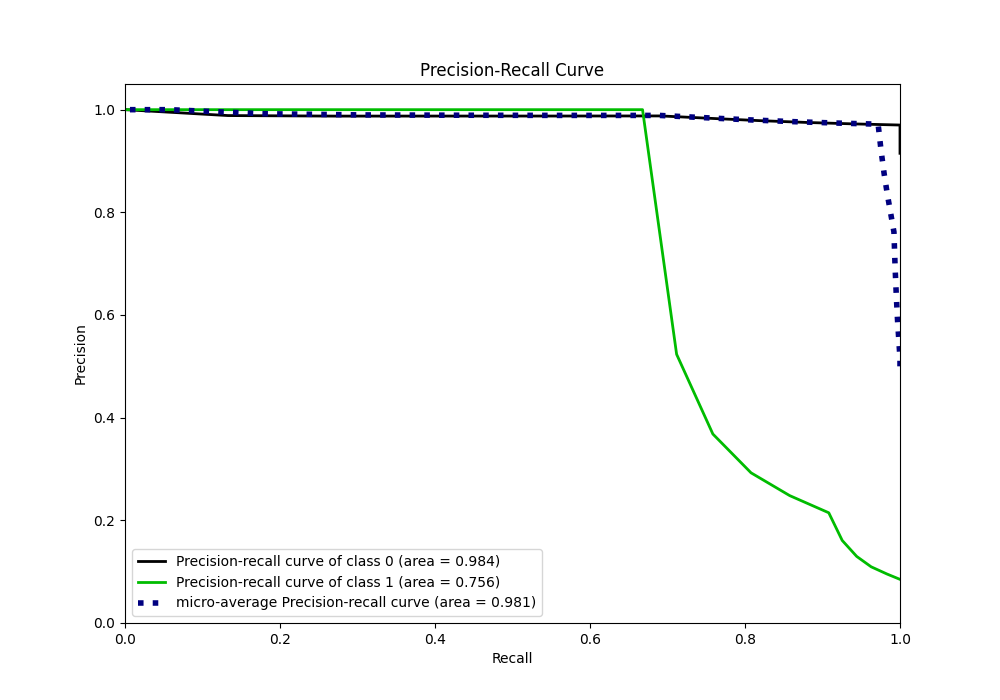
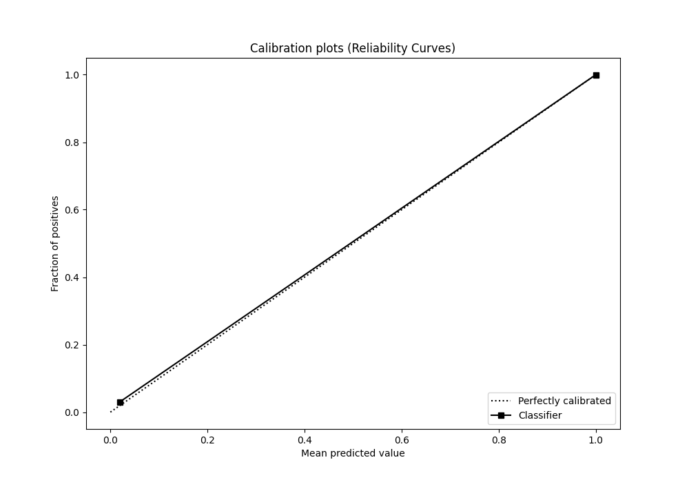
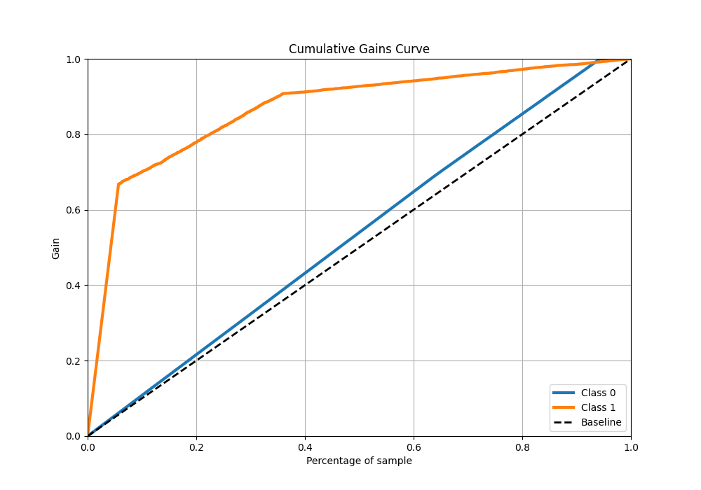
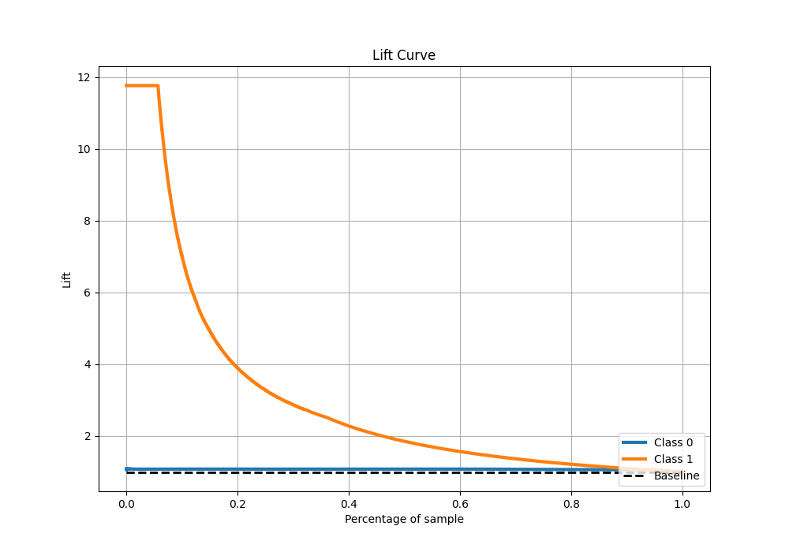

# Summary of 1_DecisionTree

[<< Go back](../README.md)

## Decision Tree
- **n_jobs**: -1
- **criterion**: gini
- **max_depth**: 3
- **explain_level**: 1

## Validation
 - **validation_type**: kfold
 - **k_folds**: 5
 - **shuffle**: True
 - **stratify**: True

## Optimized metric
logloss

## Training time

55.5 seconds

## Metric details
|           |    score |    threshold |
|:----------|---------:|-------------:|
| logloss   | 0.11699  | nan          |
| auc       | 0.902112 | nan          |
| f1        | 0.800811 |   0.0694736  |
| accuracy  | 0.971762 |   0.0694736  |
| precision | 1        |   0.0694736  |
| recall    | 1        |   0.00991861 |
| mcc       | 0.804862 |   0.0694736  |

## Metric details with threshold from accuracy metric
|           |    score |   threshold |
|:----------|---------:|------------:|
| logloss   | 0.11699  | nan         |
| auc       | 0.902112 | nan         |
| f1        | 0.800811 |   0.0694736 |
| accuracy  | 0.971762 |   0.0694736 |
| precision | 1        |   0.0694736 |
| recall    | 0.667794 |   0.0694736 |
| mcc       | 0.804862 |   0.0694736 |

## Confusion matrix (at threshold=0.069474)
|              |   Predicted as 0 |   Predicted as 1 |
|:-------------|-----------------:|-----------------:|
| Labeled as 0 |            73200 |                0 |
| Labeled as 1 |             2259 |             4541 |

## Learning curves

## Permutation-based Importance

## Confusion Matrix

## Normalized Confusion Matrix

## ROC Curve

## Kolmogorov-Smirnov Statistic

## Precision-Recall Curve

## Calibration Curve

## Cumulative Gains Curve

## Lift Curve

[<< Go back](../README.md)
