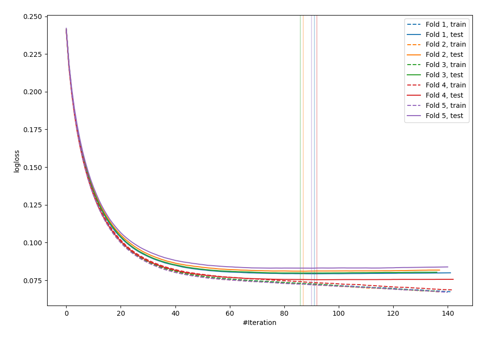
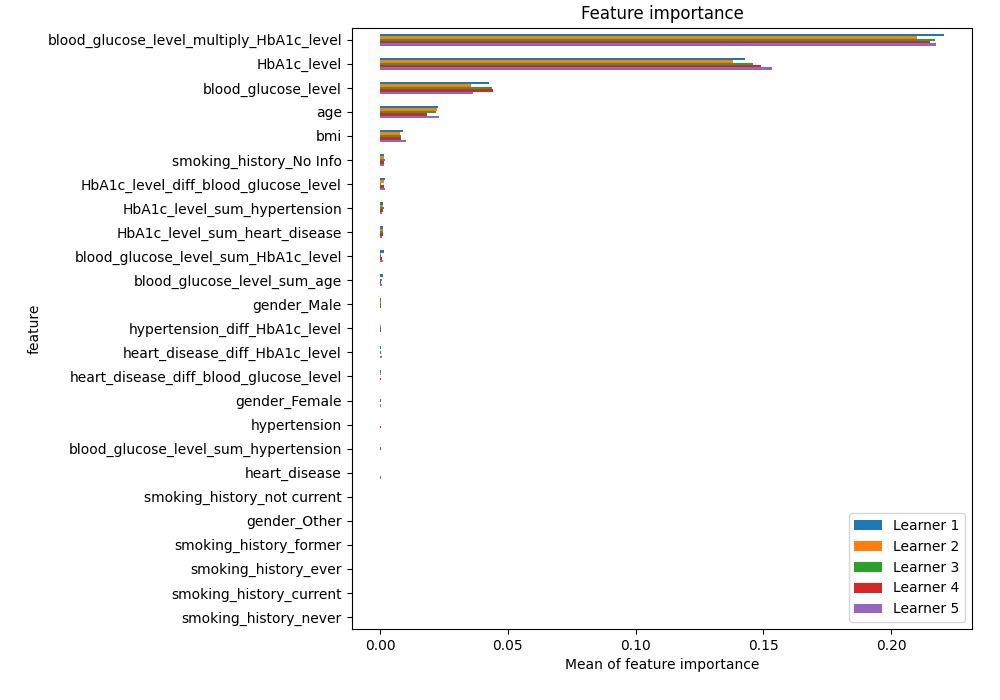
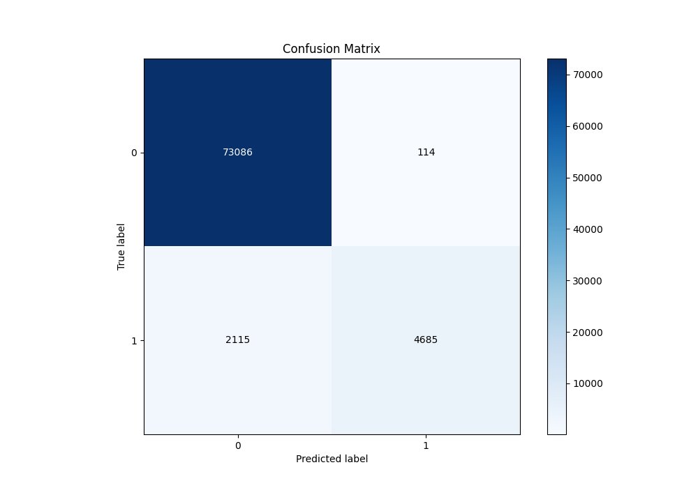
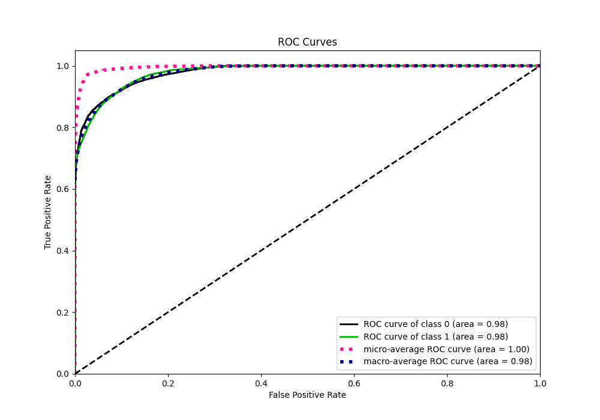
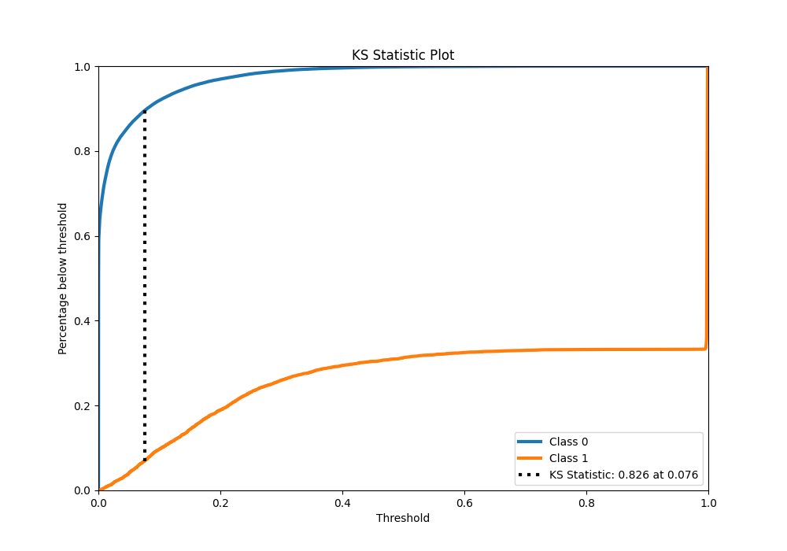
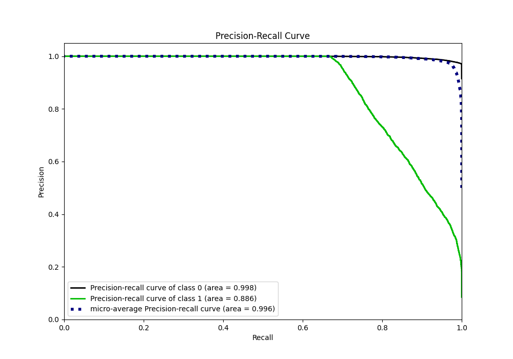
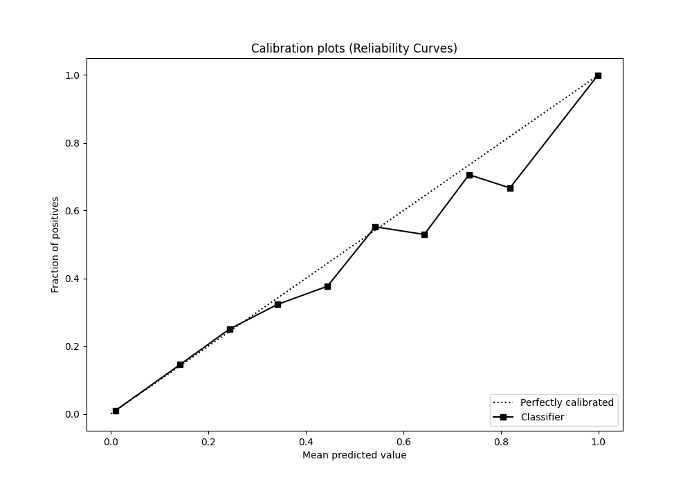
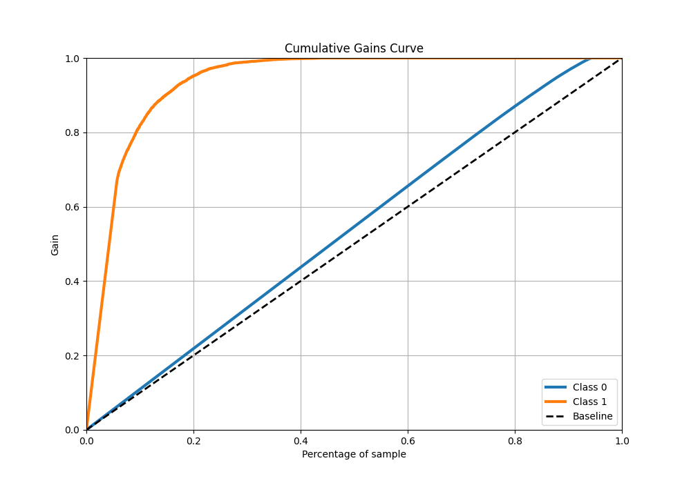
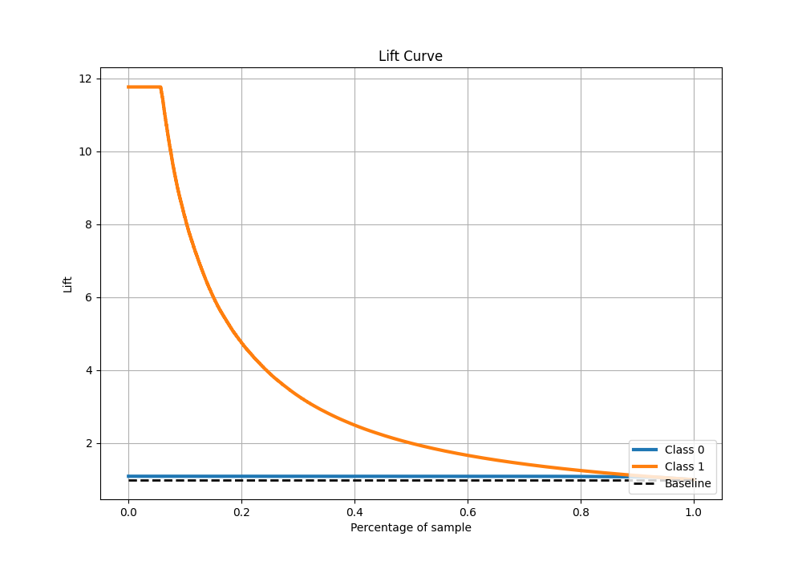

# Summary of 6_Xgboost_GoldenFeatures

[<< Go back](../README.md)

## Extreme Gradient Boosting (Xgboost)
- **n_jobs**: -1
- **objective**: binary:logistic
- **eta**: 0.075
- **max_depth**: 8
- **min_child_weight**: 5
- **subsample**: 1.0
- **colsample_bytree**: 1.0
- **eval_metric**: logloss
- **explain_level**: 1

## Validation
 - **validation_type**: kfold
 - **k_folds**: 5
 - **shuffle**: True
 - **stratify**: True

## Optimized metric
logloss

## Training time

36.4 seconds

## Metric details
|           |     score |     threshold |
|:----------|----------:|--------------:|
| logloss   | 0.0797254 | nan           |
| auc       | 0.979014  | nan           |
| f1        | 0.807828  |   0.494189    |
| accuracy  | 0.972137  |   0.494189    |
| precision | 1         |   0.99741     |
| recall    | 1         |   9.51015e-05 |
| mcc       | 0.807311  |   0.494189    |

## Metric details with threshold from accuracy metric
|           |     score |   threshold |
|:----------|----------:|------------:|
| logloss   | 0.0797254 |  nan        |
| auc       | 0.979014  |  nan        |
| f1        | 0.807828  |    0.494189 |
| accuracy  | 0.972137  |    0.494189 |
| precision | 0.976245  |    0.494189 |
| recall    | 0.688971  |    0.494189 |
| mcc       | 0.807311  |    0.494189 |

## Confusion matrix (at threshold=0.494189)
|              |   Predicted as 0 |   Predicted as 1 |
|:-------------|-----------------:|-----------------:|
| Labeled as 0 |            73086 |              114 |
| Labeled as 1 |             2115 |             4685 |

## Learning curves

## Permutation-based Importance

## Confusion Matrix

## Normalized Confusion Matrix

## ROC Curve

## Kolmogorov-Smirnov Statistic

## Precision-Recall Curve

## Calibration Curve

## Cumulative Gains Curve

## Lift Curve

[<< Go back](../README.md)
