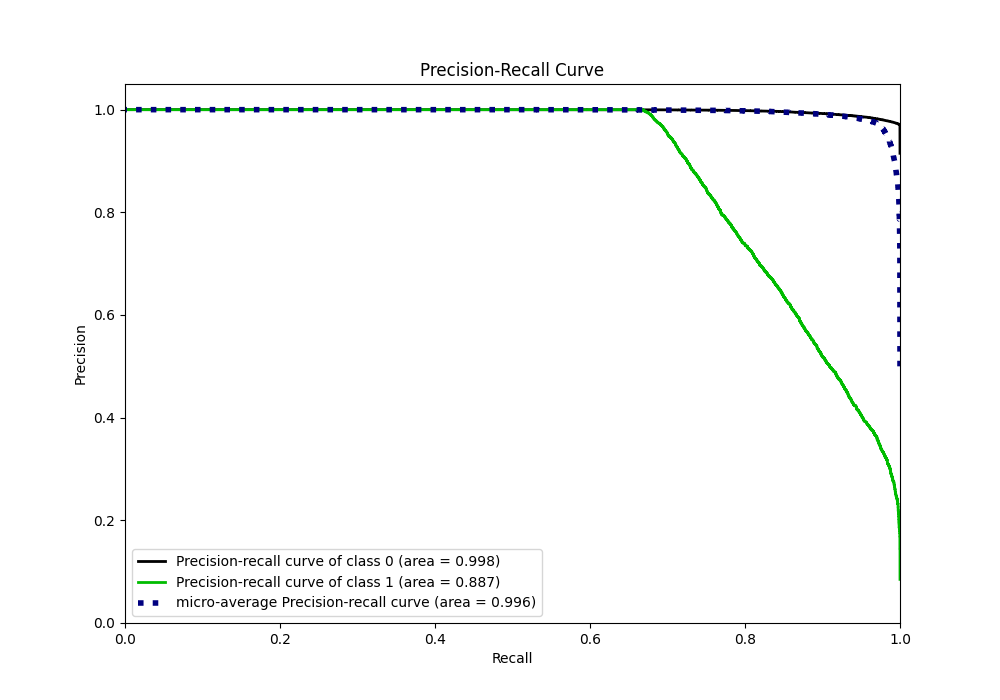

# Summary of 8_Xgboost

[<< Go back](../README.md)

## Extreme Gradient Boosting (Xgboost)
- **n_jobs**: -1
- **objective**: binary:logistic
- **eta**: 0.1
- **max_depth**: 7
- **min_child_weight**: 25
- **subsample**: 0.9
- **colsample_bytree**: 0.6
- **eval_metric**: logloss
- **explain_level**: 1

## Validation
 - **validation_type**: kfold
 - **k_folds**: 5
 - **shuffle**: True
 - **stratify**: True

## Optimized metric
logloss

## Training time

41.1 seconds

## Metric details
|           |     score |    threshold |
|:----------|----------:|-------------:|
| logloss   | 0.0807353 | nan          |
| auc       | 0.97919   | nan          |
| f1        | 0.806449  |   0.479264   |
| accuracy  | 0.971938  |   0.479264   |
| precision | 1         |   0.972692   |
| recall    | 1         |   0.00014167 |
| mcc       | 0.805801  |   0.479264   |

## Metric details with threshold from accuracy metric
|           |     score |   threshold |
|:----------|----------:|------------:|
| logloss   | 0.0807353 |  nan        |
| auc       | 0.97919   |  nan        |
| f1        | 0.806449  |    0.479264 |
| accuracy  | 0.971938  |    0.479264 |
| precision | 0.974578  |    0.479264 |
| recall    | 0.687794  |    0.479264 |
| mcc       | 0.805801  |    0.479264 |

## Confusion matrix (at threshold=0.479264)
|              |   Predicted as 0 |   Predicted as 1 |
|:-------------|-----------------:|-----------------:|
| Labeled as 0 |            73078 |              122 |
| Labeled as 1 |             2123 |             4677 |

## Learning curves

## Permutation-based Importance

## Confusion Matrix

## Normalized Confusion Matrix

## ROC Curve

## Kolmogorov-Smirnov Statistic

## Precision-Recall Curve

## Calibration Curve

## Cumulative Gains Curve

## Lift Curve

[<< Go back](../README.md)
