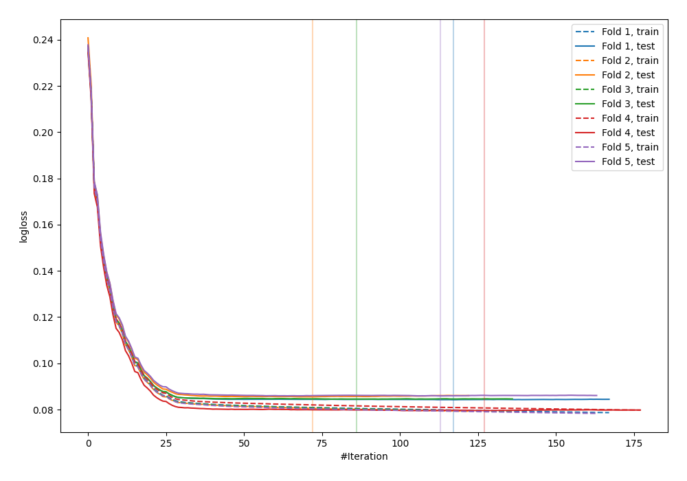
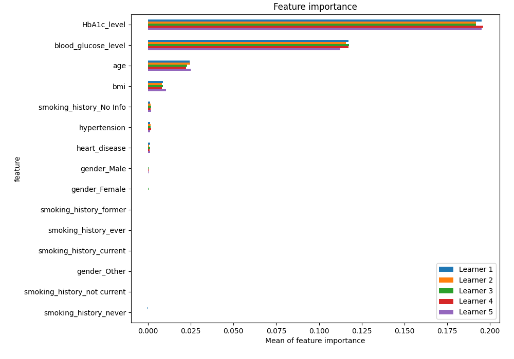
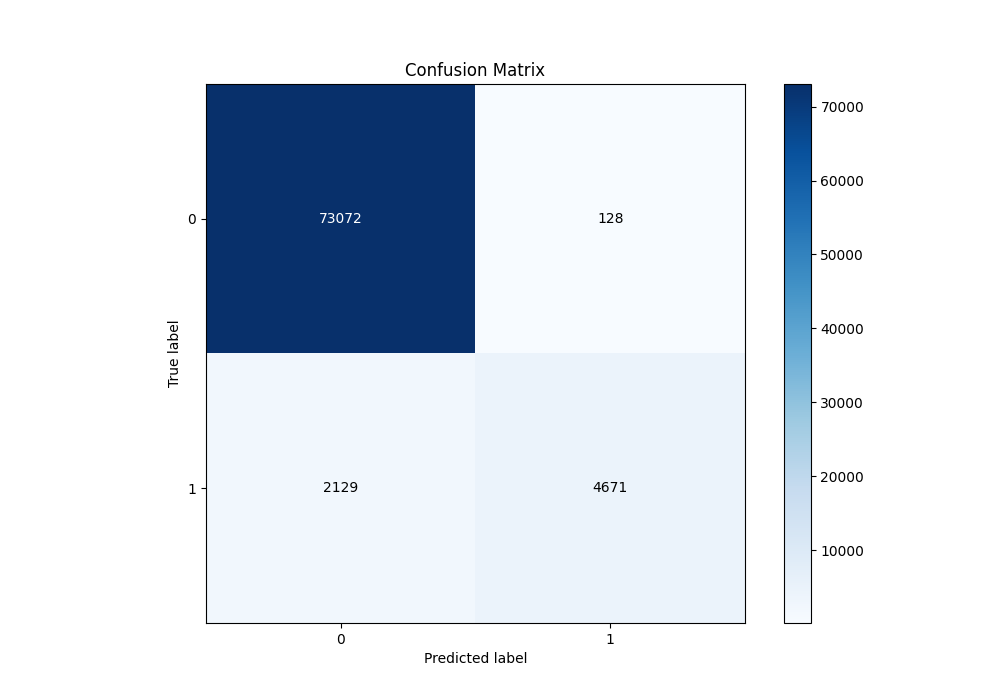
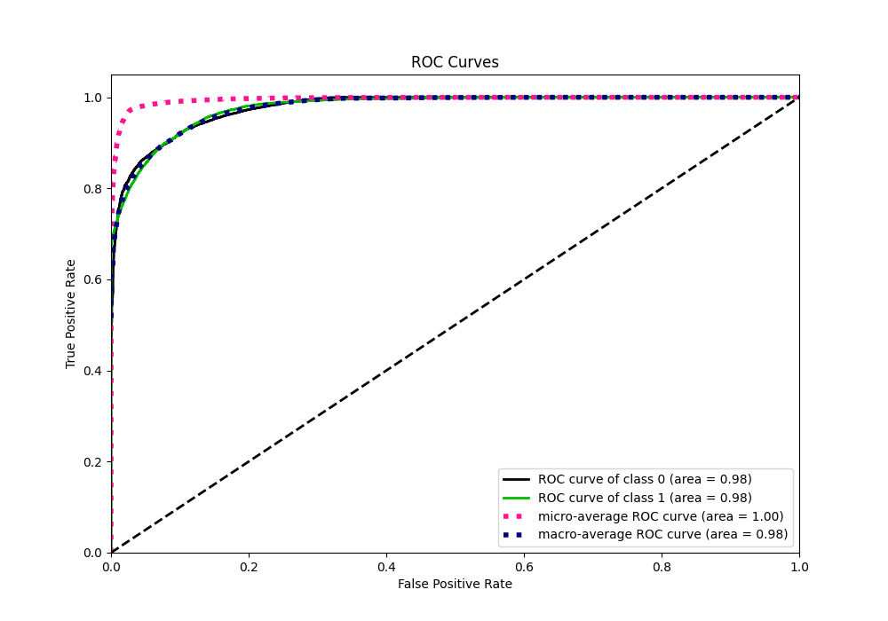
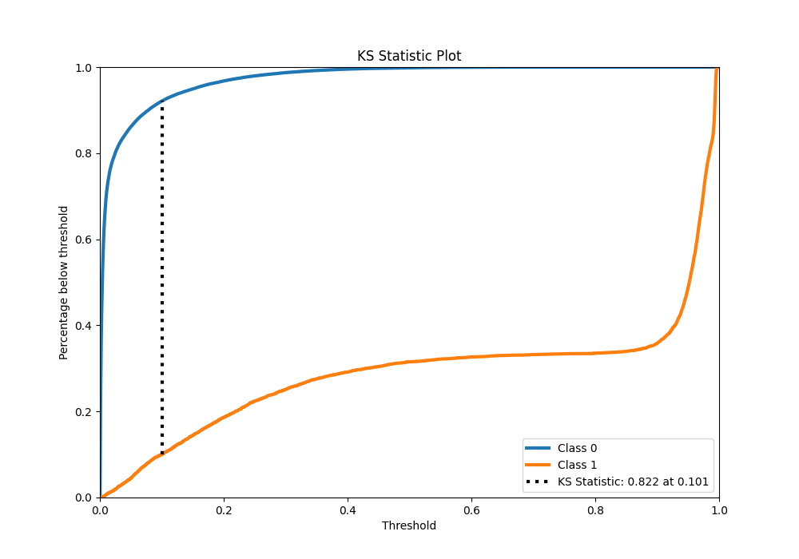
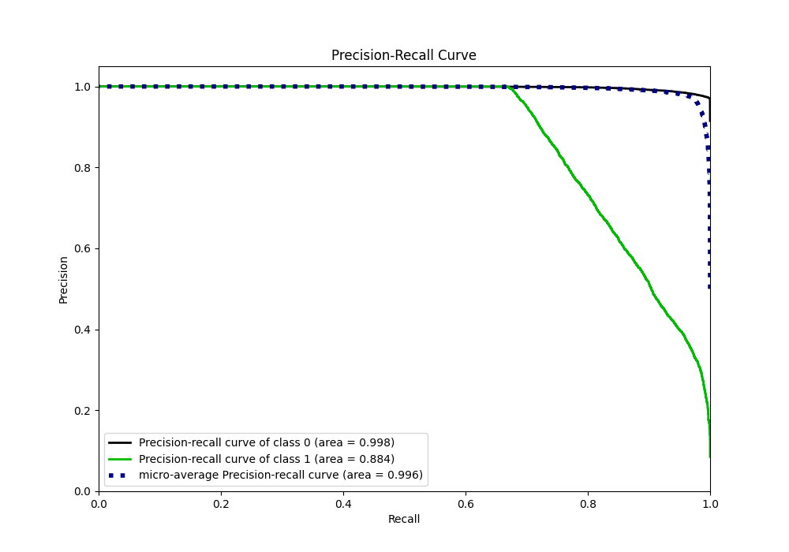
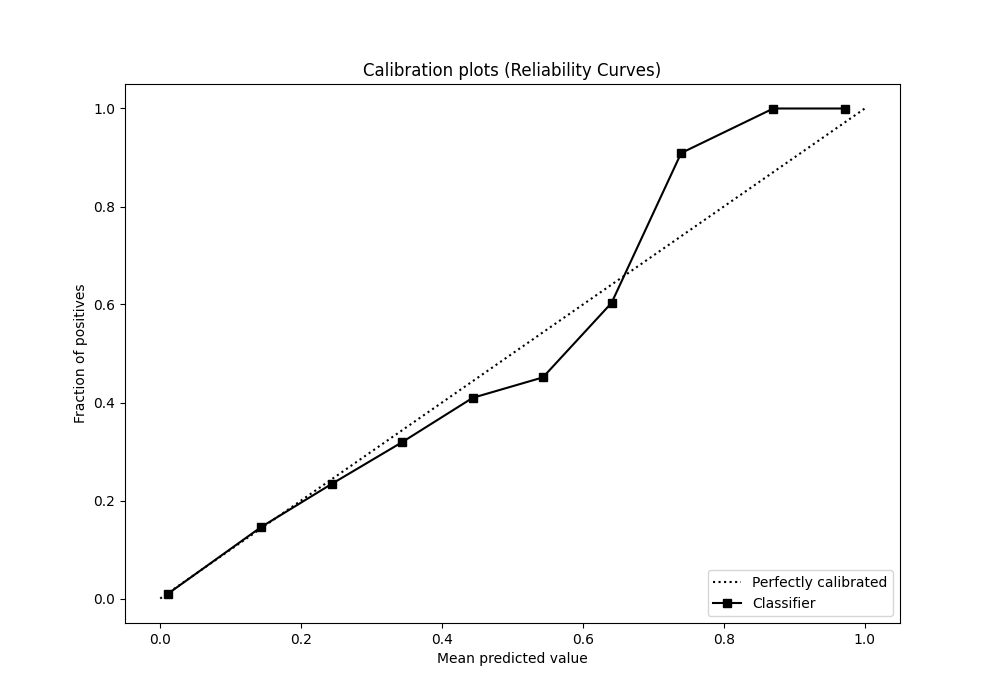
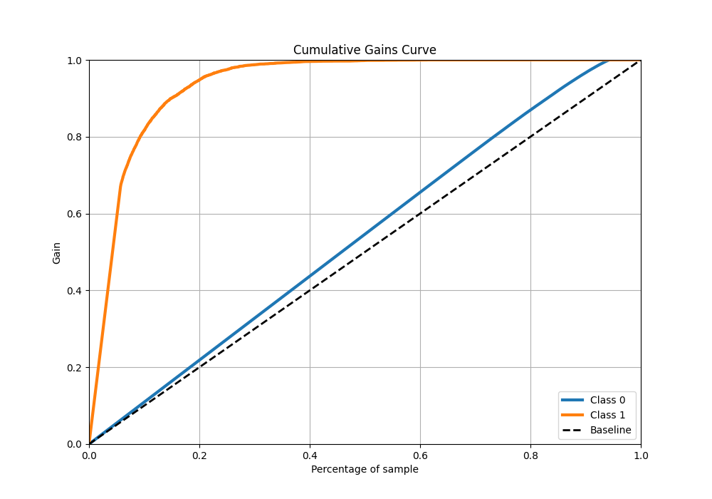
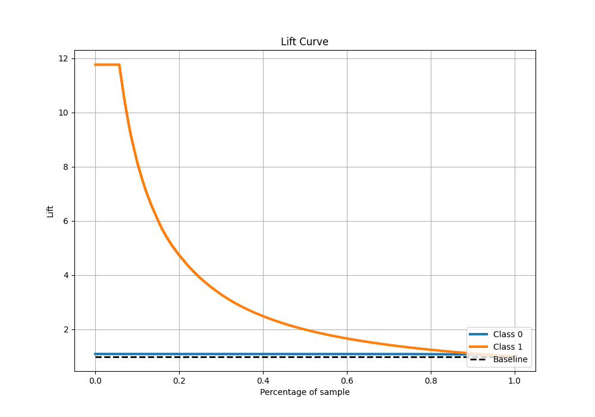

# Summary of 9_Xgboost

[<< Go back](../README.md)

## Extreme Gradient Boosting (Xgboost)
- **n_jobs**: -1
- **objective**: binary:logistic
- **eta**: 0.15
- **max_depth**: 8
- **min_child_weight**: 50
- **subsample**: 0.6
- **colsample_bytree**: 0.6
- **eval_metric**: logloss
- **explain_level**: 1

## Validation
 - **validation_type**: kfold
 - **k_folds**: 5
 - **shuffle**: True
 - **stratify**: True

## Optimized metric
logloss

## Training time

32.3 seconds

## Metric details
|           |     score |   threshold |
|:----------|----------:|------------:|
| logloss   | 0.0839567 | nan         |
| auc       | 0.977695  | nan         |
| f1        | 0.805414  |   0.489164  |
| accuracy  | 0.971788  |   0.489164  |
| precision | 1         |   0.933093  |
| recall    | 1         |   0.0001576 |
| mcc       | 0.804668  |   0.489164  |

## Metric details with threshold from accuracy metric
|           |     score |   threshold |
|:----------|----------:|------------:|
| logloss   | 0.0839567 |  nan        |
| auc       | 0.977695  |  nan        |
| f1        | 0.805414  |    0.489164 |
| accuracy  | 0.971788  |    0.489164 |
| precision | 0.973328  |    0.489164 |
| recall    | 0.686912  |    0.489164 |
| mcc       | 0.804668  |    0.489164 |

## Confusion matrix (at threshold=0.489164)
|              |   Predicted as 0 |   Predicted as 1 |
|:-------------|-----------------:|-----------------:|
| Labeled as 0 |            73072 |              128 |
| Labeled as 1 |             2129 |             4671 |

## Learning curves

## Permutation-based Importance

## Confusion Matrix

## Normalized Confusion Matrix

## ROC Curve

## Kolmogorov-Smirnov Statistic

## Precision-Recall Curve

## Calibration Curve

## Cumulative Gains Curve

## Lift Curve

[<< Go back](../README.md)
