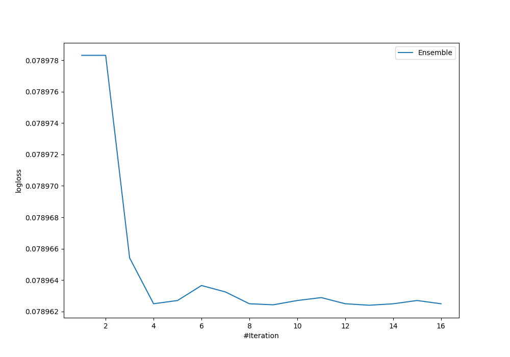
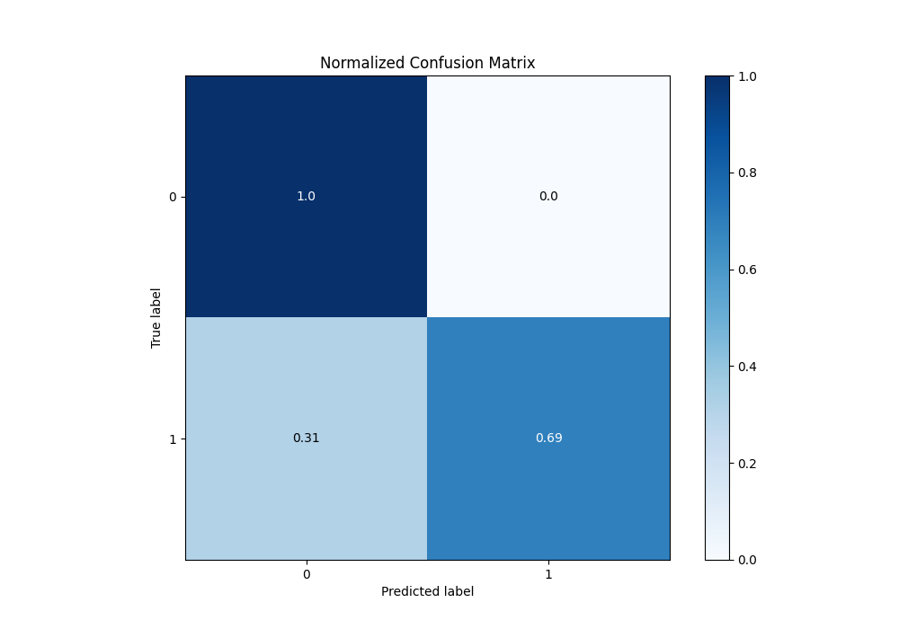
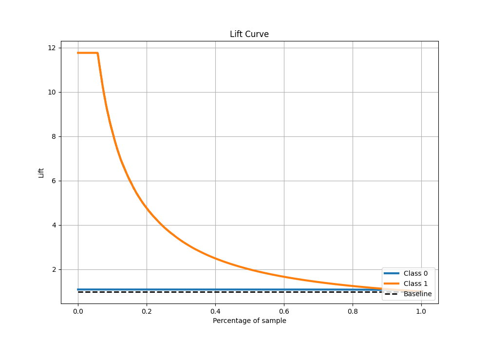

# Summary of Ensemble

[<< Go back](../README.md)

## Ensemble structure
| Model             |   Weight |
|:------------------|---------:|
| 4_Default_Xgboost |       10 |
| 7_Xgboost         |        3 |

## Metric details
|           |     score |     threshold |
|:----------|----------:|--------------:|
| logloss   | 0.0789624 | nan           |
| auc       | 0.979507  | nan           |
| f1        | 0.806966  |   0.472006    |
| accuracy  | 0.972012  |   0.472006    |
| precision | 1         |   0.99912     |
| recall    | 1         |   1.23171e-05 |
| mcc       | 0.806367  |   0.472006    |

## Metric details with threshold from accuracy metric
|           |     score |   threshold |
|:----------|----------:|------------:|
| logloss   | 0.0789624 |  nan        |
| auc       | 0.979507  |  nan        |
| f1        | 0.806966  |    0.472006 |
| accuracy  | 0.972012  |    0.472006 |
| precision | 0.975203  |    0.472006 |
| recall    | 0.688235  |    0.472006 |
| mcc       | 0.806367  |    0.472006 |

## Confusion matrix (at threshold=0.472006)
|              |   Predicted as 0 |   Predicted as 1 |
|:-------------|-----------------:|-----------------:|
| Labeled as 0 |            73081 |              119 |
| Labeled as 1 |             2120 |             4680 |

## Learning curves

## Confusion Matrix

## Normalized Confusion Matrix

## ROC Curve

## Kolmogorov-Smirnov Statistic

## Precision-Recall Curve

## Calibration Curve

## Cumulative Gains Curve

## Lift Curve

[<< Go back](../README.md)
