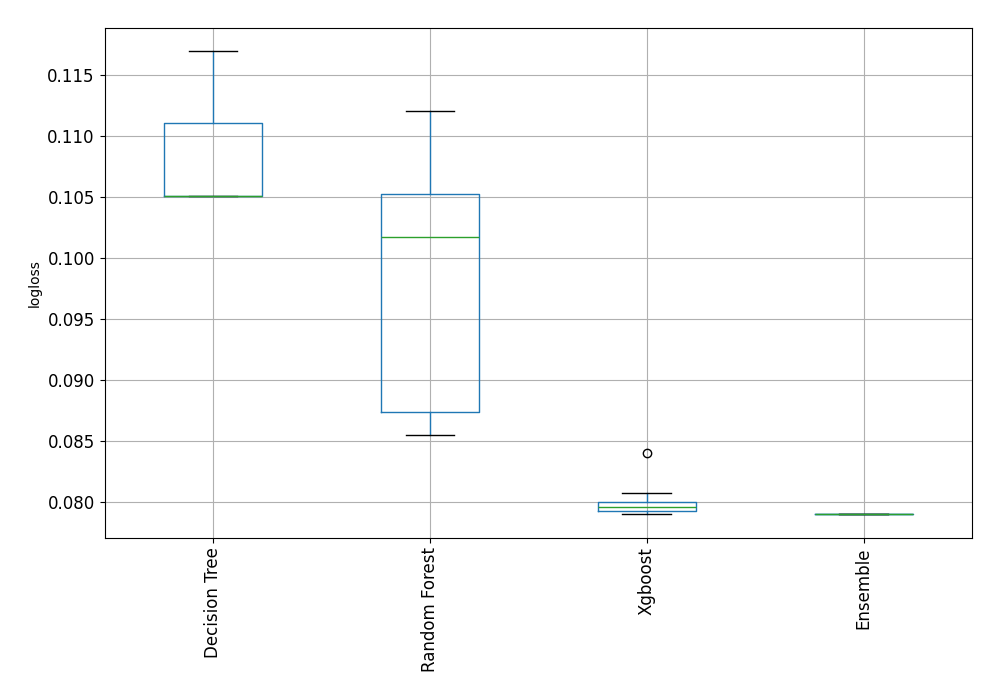
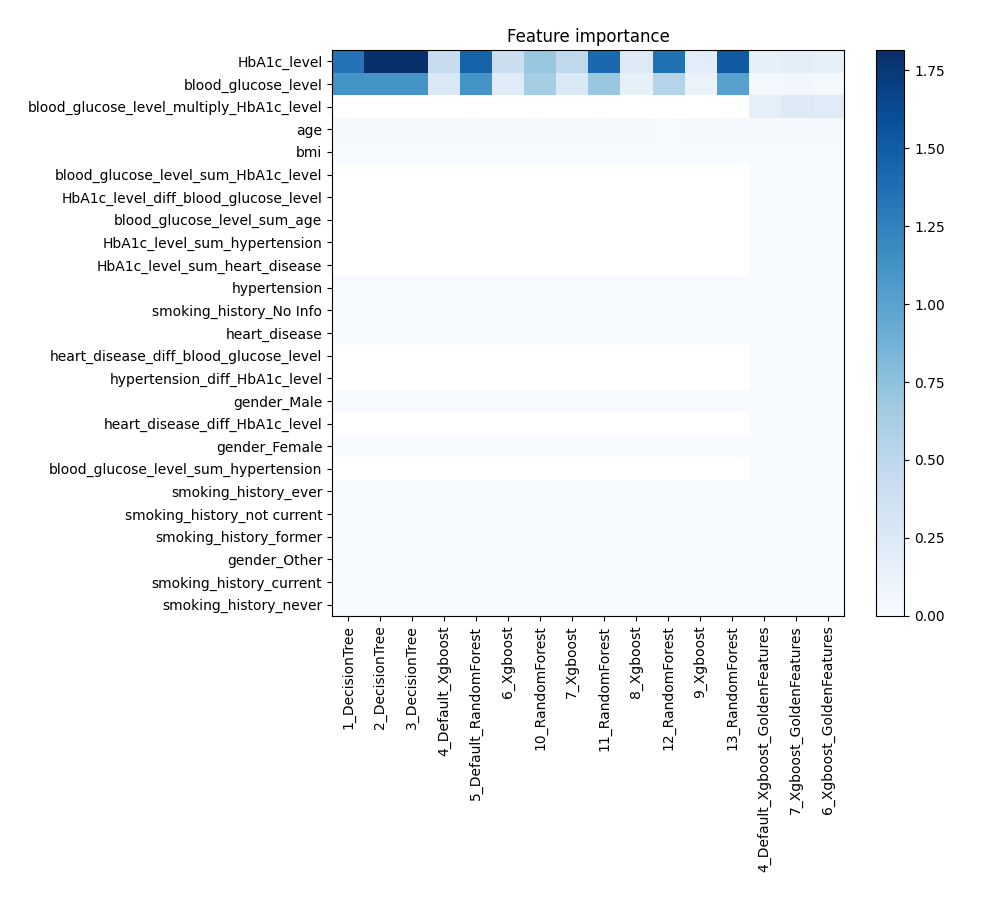

# AutoML Leaderboard

| Best model   | name                                                                           | model_type    | metric_type   |   metric_value |   train_time |   single_prediction_time |
|:-------------|:-------------------------------------------------------------------------------|:--------------|:--------------|---------------:|-------------:|-------------------------:|
|              | [1_DecisionTree](1_DecisionTree/README.md)                                     | Decision Tree | logloss       |      0.11699   |        57.1  |                   0.1464 |
|              | [2_DecisionTree](2_DecisionTree/README.md)                                     | Decision Tree | logloss       |      0.105097  |        50.46 |                   0.149  |
|              | [3_DecisionTree](3_DecisionTree/README.md)                                     | Decision Tree | logloss       |      0.105097  |        50.77 |                   0.1449 |
|              | [4_Default_Xgboost](4_Default_Xgboost/README.md)                               | Xgboost       | logloss       |      0.0789783 |        31.27 |                   0.1474 |
|              | [5_Default_RandomForest](5_Default_RandomForest/README.md)                     | Random Forest | logloss       |      0.101761  |        34.37 |                   0.8934 |
|              | [6_Xgboost](6_Xgboost/README.md)                                               | Xgboost       | logloss       |      0.0793339 |        33.1  |                   0.1455 |
|              | [10_RandomForest](10_RandomForest/README.md)                                   | Random Forest | logloss       |      0.105246  |        29.34 |                   0.2903 |
|              | [7_Xgboost](7_Xgboost/README.md)                                               | Xgboost       | logloss       |      0.0791386 |        29.91 |                   0.1467 |
|              | [11_RandomForest](11_RandomForest/README.md)                                   | Random Forest | logloss       |      0.0854321 |        65.18 |                   0.3418 |
|              | [8_Xgboost](8_Xgboost/README.md)                                               | Xgboost       | logloss       |      0.0807353 |        42.92 |                   0.1541 |
|              | [12_RandomForest](12_RandomForest/README.md)                                   | Random Forest | logloss       |      0.112054  |        28.35 |                   0.2675 |
|              | [9_Xgboost](9_Xgboost/README.md)                                               | Xgboost       | logloss       |      0.0839567 |        34.27 |                   0.1571 |
|              | [13_RandomForest](13_RandomForest/README.md)                                   | Random Forest | logloss       |      0.0873966 |        51.14 |                   0.3929 |
|              | [4_Default_Xgboost_GoldenFeatures](4_Default_Xgboost_GoldenFeatures/README.md) | Xgboost       | logloss       |      0.0793227 |        40.76 |                   0.2174 |
|              | [7_Xgboost_GoldenFeatures](7_Xgboost_GoldenFeatures/README.md)                 | Xgboost       | logloss       |      0.0797409 |        36.49 |                   0.2137 |
|              | [6_Xgboost_GoldenFeatures](6_Xgboost_GoldenFeatures/README.md)                 | Xgboost       | logloss       |      0.0797254 |        38.28 |                   0.2196 |
| **the best** | [Ensemble](Ensemble/README.md)                                                 | Ensemble      | logloss       |      0.0789624 |        10.64 |                   0.309  |

### AutoML Performance

### AutoML Performance Boxplot

### Features Importance

### Spearman Correlation of Models

